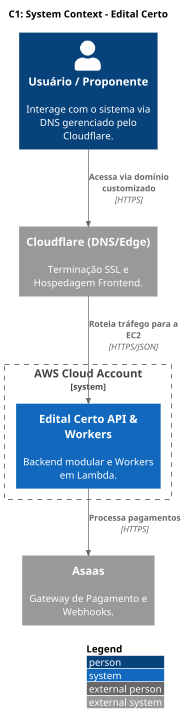
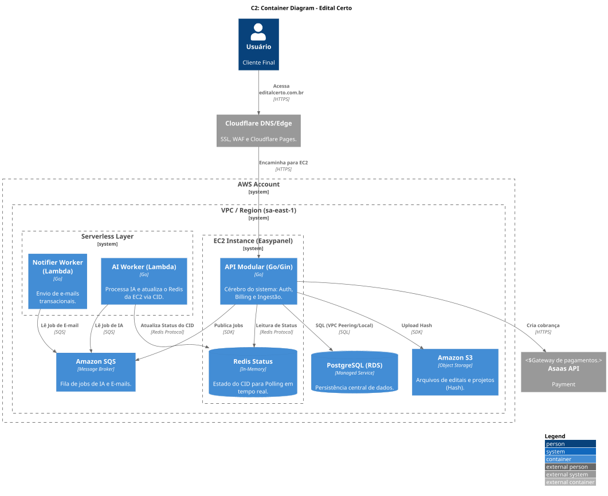
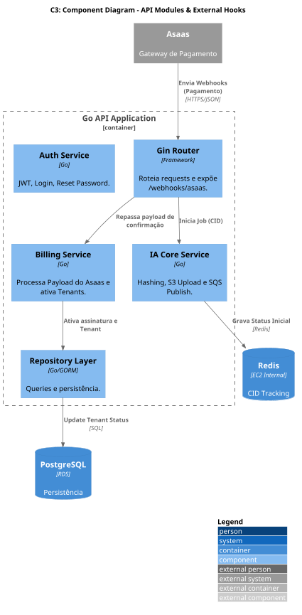

# 🏛️ Documentação de Arquitetura (C4 Model)

Este diretório centraliza a visão técnica da plataforma **Edital Certo**. Utilizamos o padrão C4 Model para descrever o sistema em diferentes níveis de abstração.

## 📍 Visão Geral
Nossa arquitetura é baseada em **Event-Driven Design** para processamentos pesados de IA, garantindo que o usuário nunca fique esperando uma resposta síncrona de longa duração.

---

## 🗺️ Níveis de Documentação

### 1. [Nível 1: Contexto](./c1_context.md)
**Público:** Stakeholders e novos desenvolvedores.
**Foco:** Integrações externas (Asaas, Cloudflare, AWS) e usuários.

### 2. [Nível 2: Containers](./c2_container.md)
**Público:** Time de Backend e DevOps.
**Foco:** Topologia de rede (EC2, RDS, Lambda) e comunicação via SQS/Redis.

### 3. [Nível 3: Componentes](./c3_component.md)
**Público:** Desenvolvedores Backend.
**Foco:** Estrutura modular da API Go (Auth, Billing, IA Core).

### 4. [Nível 4: Código](./c4_code.puml)
**Público:** Engenheiros de Software.
**Foco:** Diagrama de classes/structs gerado automaticamente via `goplantuml`.
*(Consulte o arquivo .puml para detalhes de implementação)*

---

## ⚡ Decisões Arquiteturais (ADRs)

* **Asynchronous Processing**: Utilizamos SQS + Lambda para IA para evitar timeouts no Gateway (Cloudflare) e na API.
* **Correlation ID (CID)**: Toda tarefa de IA gera um CID único que é rastreado via Redis para permitir o polling do Frontend (Angular).
* **Modular Monolith**: A API é organizada em módulos internos (internal/modules) para facilitar uma futura extração para microsserviços, se necessário.
* **Database Isolation**: Apenas a API na EC2 tem acesso ao RDS; Workers processam dados e notificam a API ou atualizam o Redis/S3.

---

## 🛠️ Como atualizar os diagramas
Os diagramas são escritos em **PlantUML**.
1. Instale a extensão PlantUML na IDE.
2. Edite os arquivos `.puml`.
3. Exporte para `.png` e atualize os arquivos correspondentes neste diretório.